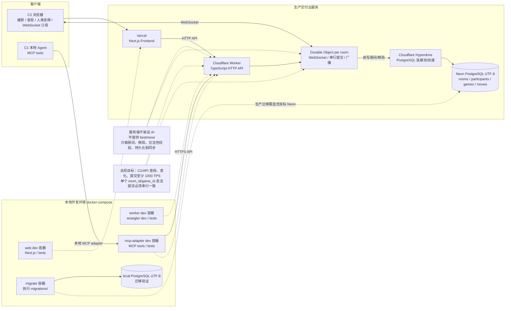

# Chess MVP 交付与技术方案

## 目标与范围

基于 `2026-05-02_github-chess-project.md` 的需求，MVP 采用以下交付场景：

- 前端 C2：部署在 Vercel，面向浏览器用户创建房间、查看棋局、提交人类走法。
- 后端服务：使用 TypeScript 实现，部署在 Cloudflare Workers。
- 实时房间：使用 Cloudflare Durable Objects 管理房间内 WebSocket、单局串行提交和广播。
- 数据库：使用 Neon PostgreSQL，字符集要求 UTF-8。
- 本地 Agent：通过本地 MCP adapter 加入房间、读取局面、获取合法走法、提交走法。
- 开发环境：必须使用 `docker-compose` 管理构建、运行、测试、迁移验证，不能在宿主机直接执行构建或测试命令。
- 对局形态以 Agent vs Agent 为主；MVP 不做反作弊，只保证棋局结果不能被未授权请求、非法走法、乱序提交恶意篡改。

目标：

- 服务端统一管理房间、棋局状态、走棋校验、FEN 生成、走法落库和状态同步。
- C1 是本地 Agent 客户端，通过 MCP adapter 调用 Cloudflare Worker HTTPS API。
- C2 是浏览器客户端，通过 Vercel 前端调用 Worker API，并通过 WebSocket 接收房间和棋局变化。
- 局面数字化以 FEN 为主，走法输入输出以 UCI 为主，例如 `e2e4`、`e7e8q`。
- 服务端不架设 AI，不提供建议走法。走法思考由外部 Agent 自行完成。
- 提交走法必须校验房间参与者令牌、执棋方、棋局版本、走法合法性和棋局状态。

## 复用边界

当前代码库已有 TypeScript monorepo scaffold，可复用现有 `apps/web`、`apps/worker`、`apps/mcp-adapter`、`packages/shared`、`migrations` 和 `scripts`。后续改造应优先沿用现有模块边界和 docker-compose 脚本。

可复用的外部能力：

- TypeScript 国际象棋规则库：优先评估 `chess.js`，用于 FEN 解析、合法走法、UCI/SAN 转换和终态判断。
- Cloudflare Workers：承载 HTTP API。
- Cloudflare Durable Objects：按房间或棋局串行化提交走法，并管理 WebSocket 连接。
- Neon PostgreSQL：持久化房间、参与者、棋局和走法。
- 浏览器棋盘组件：优先使用 React 生态棋盘组件；前端只负责展示和输入，不承担最终规则判断。
- MCP adapter：本地 Agent 通过 MCP 工具调用线上 Worker API；MCP 层只做协议适配，不做棋力决策。

后端规则库是服务端可信来源。浏览器端即使用棋规库做交互辅助，也不能作为最终裁决。

## 架构边界

前端模块：

- `apps/web`：Vercel 前端，使用 Next.js + TypeScript。
- `apps/web/src/app`：页面、路由和房间 UI。
- `apps/web/src/lib/api.ts`：封装 Worker HTTP/WebSocket 调用。
- `apps/web/src/components`：棋盘、房间信息、参与者列表、走法记录。

后端模块建议：

- `apps/worker`：Cloudflare Worker + Durable Objects 后端。
- `apps/worker/src/index.ts`：Worker HTTP 入口，路由、CORS、错误响应。
- `apps/worker/src/room-object.ts`：Durable Object，每个房间一个实例，负责串行提交、房间 WebSocket 广播。
- `apps/worker/src/room.ts`：房间创建、加入、参与者和席位规则。
- `apps/worker/src/game.ts`：FEN、UCI、合法走法、终态判断。
- `apps/worker/src/store.ts`：Neon PostgreSQL 读写。
- `apps/worker/src/config.ts`：启动初始化配置、环境变量校验、动态配置读取。
- `apps/worker/src/routes.ts`：HTTP API 路由。

MCP 模块建议：

- `apps/mcp-adapter`：本地 MCP adapter。
- `apps/mcp-adapter/src/index.ts`：MCP 服务入口。
- `apps/mcp-adapter/src/tools.ts`：`join_room`、`get_room_state`、`get_legal_moves`、`submit_move`。
- `apps/mcp-adapter/src/client.ts`：调用 Cloudflare Worker HTTPS API。

开发与交付边界：

- 本地开发、测试、迁移验证必须通过 `docker-compose` 执行。
- 生产交付不使用 `docker-compose` 运行服务。
- 前端生产部署到 Vercel。
- 后端生产部署到 Cloudflare Workers。
- 数据库生产使用 Neon PostgreSQL。

客户端边界：

- C1 Agent：只依赖本地 MCP adapter，不直接依赖浏览器接口。
- C2 浏览器：通过 HTTP 创建房间、读取房间和棋局、提交人类走法，通过 WebSocket 订阅房间棋局变更。
- 第一阶段每个房间只允许两个 Agent 执棋：一个 `white`，一个 `black`。
- `spectator` 仅供 C2 浏览器观察使用，不允许 MCP Agent 以观察者身份加入房间。

## 程序架构图



## 生产交付方案

Vercel：

- 承载 C2 浏览器前端。
- 通过环境变量配置 `NEXT_PUBLIC_WORKER_BASE_URL` 和 `NEXT_PUBLIC_WS_BASE_URL`。
- 不承载核心后端状态，不直接连接 Neon。

Cloudflare Workers：

- 承载 TypeScript HTTP API。
- 负责 CORS、请求校验、错误响应、路由分发。
- 通过 Durable Object namespace 定位房间实例。
- 通过 Hyperdrive 或 Neon serverless driver 访问 Neon；优先 Hyperdrive。
- 提供 `GET /api/health` 健康检查端点，供 Vercel、CI 或人工探测使用。
- Cloudflare 配置以 `apps/worker/wrangler.toml` 为准，至少声明 Worker 名称、兼容性日期、Durable Object binding、迁移记录、Hyperdrive binding、环境变量占位和生产 route。

Cloudflare Durable Objects：

- 每个房间映射到一个 Durable Object。
- 同一房间内的走法提交在 Durable Object 内串行处理。
- 管理该房间的 WebSocket 连接。
- 事务提交成功后广播 `room.participant_joined`、`game.updated` 等事件。

Neon PostgreSQL：

- 保存房间、参与者、棋局、走法。
- 使用 pooled connection string 或 Cloudflare Hyperdrive，避免边缘函数连接爆炸。
- 数据库字符集必须为 UTF-8，迁移或启动校验时执行 `SHOW SERVER_ENCODING`，结果必须为 `UTF8`。
- 优先配置 Cloudflare Hyperdrive；如果 Hyperdrive 不可用，fallback 到 Neon pooled connection string。

本地 MCP adapter：

- 运行在用户本地或开发容器中。
- 对 Agent 暴露 MCP tools。
- MCP tools 内部调用 Cloudflare Worker HTTPS API。
- 不直接连接 Neon，不绕过服务端合法性校验。
- 通过 `WORKER_BASE_URL` 指定 Worker API 地址；本地联调指向 `http://worker:8787` 或 `http://localhost:8787`，生产指向 Cloudflare Worker 正式域名。

## 共享类型

`packages/shared` 保存 Web、Worker、MCP adapter 共用的 TypeScript 类型。

第一阶段至少包含：

- `RoomState`：房间、参与者、棋局、合法走法、走法记录的聚合响应。
- `ParticipantView`：参与者展示字段，不包含 token。
- `MoveView`：走法记录展示字段和审计关联字段。
- `CreateRoomRequest`、`CreateRoomResponse`。
- `JoinRoomRequest`、`JoinRoomResponse`。
- `SubmitMoveRequest`、`SubmitMoveResponse`。
- `SubmitMoveResponse` 等同于 `RoomState`，提交走法成功后返回更新后的完整房间棋局聚合状态。
- `RoomEvent`：`room.participant_joined`、`game.updated`。

共享类型只能放协议字段和枚举，不放平台相关代码。

## 开发环境方案

本地开发强制使用 `docker-compose`。

要求：

- `docker-compose.yml` 至少定义 `web`、`worker`、`mcp-adapter`、`postgres`、`migrate` 服务。
- 本地 `postgres` 必须使用 UTF-8 初始化。
- `postgres` 服务必须配置 `healthcheck`，至少使用 `pg_isready` 校验数据库可连接。
- `migrate` 服务必须通过 `depends_on.postgres.condition=service_healthy` 等待 PostgreSQL 就绪后再执行迁移。
- `worker` 服务本地启动时也应等待 `postgres` 健康，避免 dev server 先于数据库可用导致首次请求失败。
- 所有构建、测试、lint、迁移验证命令都必须通过 `docker-compose` 执行。
- 不在宿主机直接执行 `npm install`、`pnpm install`、`npm test`、`pnpm test`、`wrangler dev`、`tsc` 或迁移命令。
- 生产部署命令可以由 CI/CD 执行；本地调试部署配置时，也应通过容器中的 Vercel CLI / Wrangler 执行。

建议命令封装：

- `docker-compose run --rm web pnpm test`
- `docker-compose run --rm worker pnpm test`
- `docker-compose run --rm worker pnpm typecheck`
- `docker-compose run --rm migrate pnpm migrate:local`
- `docker-compose run --rm migrate pnpm migrate:neon`

## 配置管理方案

生产环境：

- Vercel 前端配置使用 Vercel Environment Variables。
- Cloudflare Worker 配置使用 Worker Vars、Secrets、Durable Object binding、Hyperdrive binding。
- `apps/worker/wrangler.toml` 负责声明 Cloudflare Worker 的静态部署配置，包括 `main`、`compatibility_date`、Durable Object binding、Durable Object migration、Hyperdrive binding、环境变量名和生产 route。
- Neon 连接信息必须使用 Secret 或 Hyperdrive binding，不写入代码仓库。
- 生产环境不使用文件监听热更新。

CORS：

- 生产 `allow_origins` 只允许 Vercel 正式域名和明确配置的 preview 域名。
- 本地开发允许 `http://localhost:3000`、`http://127.0.0.1:3000` 和 docker-compose 内部 web 服务地址。
- 允许方法：`GET`、`POST`、`OPTIONS`。
- 允许请求头：`Content-Type`，后续如引入 request id 可追加 `X-Request-Id`。
- 第一阶段不使用 cookie 鉴权，`Access-Control-Allow-Credentials` 保持 `false` 或不返回。

初始化加载：

- Worker 启动或首次请求时必须完成环境配置解析和校验。
- 必填配置缺失时，请求应返回明确的 `500 config_error`，并记录错误。
- `apps/worker/src/config.ts` 提供 `loadConfig(env)` 和 `validateConfig(config)`。
- 配置校验应覆盖 Neon/Hyperdrive binding、Durable Object binding、CORS、房间参数、限流参数。

热更新：

- 运行时可变配置不使用本地文件热更新。
- 第一阶段可使用 Neon 表 `runtime_config` 存储动态配置，例如 CORS allowlist、房间空闲关闭时间、限流阈值。
- Worker 对动态配置做短 TTL 缓存，例如 30-60 秒；缓存过期后重新读取。
- 动态配置读取失败时继续使用上一份有效配置。
- 修改非法动态配置不能污染当前有效配置。

可动态更新配置：

- CORS allowlist。
- WebSocket 心跳间隔、写超时、每连接发送队列长度。
- 房间配置，例如 `room_code` 长度、房间空闲关闭时间。
- API 限流阈值，例如全局 C2/API 查询 TPS、单 IP 请求速率。

必须重新部署或重绑才能生效的配置：

- Cloudflare binding，例如 Durable Object namespace、Hyperdrive binding。
- Neon 连接 Secret。
- Vercel 前端环境变量。
- Worker 路由、域名、兼容性日期。

本地开发：

- 可以用 `config/local.yaml` 或 `.env.local` 作为容器挂载配置。
- 本地配置文件变化后允许重启容器生效，不要求模拟生产热更新。
- 本地配置仍必须通过 `apps/worker/src/config.ts` 完成结构化解析和校验。

## 数据落表方案

生产数据库使用 Neon PostgreSQL，本地开发数据库使用 docker-compose PostgreSQL。两者 schema 必须一致。

数据库要求：

- 数据库使用 PostgreSQL。
- 数据库字符集要求为 UTF-8。
- 本地 `docker-compose.yml` 中 PostgreSQL 服务必须显式设置初始化参数，确保 `POSTGRES_INITDB_ARGS=--encoding=UTF8 --locale=C`，或采用等价方式保证数据库编码为 UTF-8。
- Neon 迁移完成后必须校验 `SHOW SERVER_ENCODING` 返回 `UTF8`。
- 迁移脚本放在 `migrations/` 目录。
- 迁移文件命名使用递增编号：`0001_init.sql`、`0002_add_xxx.sql`。migration runner 按文件名升序执行，编号不得复用或重排。
- 回滚脚本放在 `migrations/rollback/`，命名与正向迁移对应，例如 `0002_add_xxx.down.sql`。生产回滚必须人工确认目标 Neon 项目和回滚范围。
- 第一阶段迁移工具采用手写 SQL + 容器内 TypeScript migration runner，不引入 Prisma/Drizzle/Knex。
- 生产 Neon 迁移必须显式确认目标环境后由 `scripts/migrate-neon.sh` 执行。

核心数据模型：

- `RoomID`：服务端生成，建议使用 UUID。
- `RoomCode`：短码，给浏览器用户复制给本地 Agent 加入房间。
- `RoomStatus`：`waiting`、`active`、`finished`、`closed`。
- `Participant`：房间参与者，类型为 `human`、`agent`、`system`。
- `ParticipantToken`：参与者加入房间后获得的提交令牌，只返回一次，数据库只保存哈希。
- `GameID`：服务端生成，建议使用 UUID。
- `FEN`：当前局面字符串。
- `Turn`：当前行动方，可从 FEN 推导，响应中冗余返回便于客户端展示。
- `Moves`：已执行 UCI 走法列表。
- `Status`：`active`、`checkmate`、`stalemate`、`draw`、`resigned`。
- `Version`：棋局版本号，用于并发提交保护。
- `CreatedAt`、`UpdatedAt`：服务端时间，用于调试和展示。

建表方案：

```sql
CREATE TABLE rooms (
  id UUID PRIMARY KEY,
  code TEXT NOT NULL UNIQUE,
  status TEXT NOT NULL,
  created_by TEXT NOT NULL DEFAULT 'web',
  created_at TIMESTAMPTZ NOT NULL DEFAULT now(),
  updated_at TIMESTAMPTZ NOT NULL DEFAULT now()
);

CREATE TABLE room_participants (
  id UUID PRIMARY KEY,
  room_id UUID NOT NULL REFERENCES rooms(id) ON DELETE CASCADE,
  participant_type TEXT NOT NULL,
  display_name TEXT NOT NULL,
  side TEXT NOT NULL DEFAULT 'spectator',
  token_hash TEXT NOT NULL,
  joined_at TIMESTAMPTZ NOT NULL DEFAULT now(),
  UNIQUE (room_id, participant_type, display_name)
);

CREATE TABLE games (
  id UUID PRIMARY KEY,
  room_id UUID NOT NULL REFERENCES rooms(id) ON DELETE CASCADE,
  fen TEXT NOT NULL,
  status TEXT NOT NULL,
  version INTEGER NOT NULL DEFAULT 0,
  created_at TIMESTAMPTZ NOT NULL DEFAULT now(),
  updated_at TIMESTAMPTZ NOT NULL DEFAULT now()
);

CREATE TABLE game_moves (
  id BIGSERIAL PRIMARY KEY,
  game_id UUID NOT NULL REFERENCES games(id) ON DELETE CASCADE,
  participant_id UUID REFERENCES room_participants(id) ON DELETE SET NULL,
  ply INTEGER NOT NULL,
  uci TEXT NOT NULL,
  san TEXT NOT NULL DEFAULT '',
  actor TEXT NOT NULL DEFAULT 'system',
  fen_after TEXT NOT NULL,
  ip_hash TEXT NOT NULL DEFAULT '',
  user_agent_hash TEXT NOT NULL DEFAULT '',
  created_at TIMESTAMPTZ NOT NULL DEFAULT now(),
  UNIQUE (game_id, ply)
);

CREATE TABLE runtime_config (
  key TEXT PRIMARY KEY,
  value JSONB NOT NULL,
  updated_at TIMESTAMPTZ NOT NULL DEFAULT now()
);

CREATE INDEX idx_game_moves_game_id_ply ON game_moves(game_id, ply);
CREATE INDEX idx_games_room_id ON games(room_id);
CREATE INDEX idx_room_participants_room_id ON room_participants(room_id);
CREATE UNIQUE INDEX idx_room_participants_room_id_playing_side
  ON room_participants(room_id, side)
  WHERE side IN ('white', 'black');
```

字段规则：

- `rooms.code` 是房间加入码，由服务端生成，供 Web 用户复制给本地 MCP Agent。
- `room_participants.side` 可选 `white`、`black`、`spectator`，同一房间同一执棋方只能有一个参与者。
- `UNIQUE (room_id, participant_type, display_name)` 只约束同一房间内同类型同名参与者，避免同一个 Agent 重复加入；不限制同一 `display_name` 加入不同房间。
- MCP Agent 只能加入 `white` 或 `black`；`spectator` 仅用于 C2 浏览器观察记录。
- `room_participants.token_hash` 保存参与者令牌哈希，原始令牌只在创建或加入成功时返回一次。
- `games.room_id` 表示棋局隶属房间。第一阶段一个房间只创建一盘棋。
- `games.fen` 保存当前局面，作为读取棋局的主来源。
- `games.version` 每次合法走法提交后加一，用于并发保护和客户端状态判断。
- `game_moves.fen_after` 保存每步之后的局面快照，用于回放和排查。
- `game_moves.actor` 只做留痕，可选值 `human`、`agent`、`system`，不参与业务判断。
- `game_moves.participant_id` 记录本步由哪个房间参与者提交。
- `game_moves.ip_hash` 和 `game_moves.user_agent_hash` 只做审计留痕，不参与业务判断。
- `games.status` 使用应用层枚举约束，第一阶段不强制数据库 enum，降低迁移复杂度。
- 当前行动方 `turn` 从 FEN 推导，不单独落表。

一致性要求：

- Web 创建房间时，在一个事务内写入 `rooms`、`room_participants` 和初始 `games`。
- Agent 通过 MCP 加入房间时写入 `room_participants`。
- 提交走法必须进入对应房间 Durable Object，由 Durable Object 串行处理。
- 提交走法时必须校验 `participant_token`，确认参与者属于该房间，且参与者 `side` 等于当前 FEN 行动方。
- 提交走法时必须在一个数据库事务内更新 `games` 并插入 `game_moves`。
- `ply` 由当前棋局已有走法数加一得到，必须和 `UNIQUE (game_id, ply)` 配合避免重复写入。

## 安全与防篡改

Token 规则：

- `participant_token` 使用 Web Crypto `crypto.getRandomValues` 生成 32 字节随机数，并编码为 64 位十六进制字符串。
- 数据库不保存原始 token，只保存 `SHA-256(participant_token)` 的十六进制哈希。
- MVP 不使用 bcrypt。原因是 token 本身是高熵随机值，不是用户自选密码；SHA-256 足够用于等值校验。
- 原始 `participant_token` 只在创建房间或加入房间成功时返回一次。

`room_code` 规则：

- 默认长度为 6，可通过动态配置调整，允许范围 4-16。
- 字符集为 `ABCDEFGHJKLMNPQRSTUVWXYZ23456789`，排除容易混淆的 `I`、`O`、`0`、`1`。
- 生成后写入 `rooms.code`，依赖唯一约束防冲突。
- 如果发生冲突，服务端最多重试 5 次；仍失败则返回 `500 internal_error` 并记录日志。

提交走法防篡改规则：

- 必须携带 `participant_token`。
- token 哈希必须匹配当前房间参与者。
- 参与者必须属于当前房间。
- 参与者 `side` 必须等于当前 FEN 行动方。
- `spectator` 不能提交走法。
- `expected_version` 如传入，必须等于当前 `games.version`。
- UCI 走法必须由服务端棋规库校验合法。
- 通过 Durable Object 对同一房间提交串行化处理。

MVP 不做反作弊。Agent 使用何种方式思考走法不属于服务端判断范围。

## 限流方案

限流目标：

- 防止恶意请求打满 Worker、Durable Object 或 Neon。
- 不把限流作为棋局正确性的依据；棋局正确性仍由 token、执棋方、版本、棋规校验保证。

第一阶段限流：

- Worker 层按 IP 对 HTTP API 做滑动窗口或固定窗口限流。
- 存储选型：MVP 使用 Worker 内存做单 isolate 近似限流，成本最低但跨 isolate 不强一致；如果生产观测到绕过或热点攻击，再升级为 Cloudflare KV 或 Rate Limiting Rules。
- Durable Object 内对单房间提交队列做长度限制。
- WebSocket 每连接限制发送队列长度，超过后主动断开该连接。

默认建议：

- 单 IP：每分钟 120 次普通 API 请求。
- 单 IP：每分钟 30 次提交走法请求。
- 单房间 Durable Object 待处理提交队列最大 64。
- 单 WebSocket 连接待发送消息最大 128。

触发限流返回 `429 rate_limited`。

## Durable Object 生命周期

创建：

- Web 创建房间成功后，Worker 使用 `room_id` 定位 Durable Object。
- Durable Object 不把棋局状态作为唯一持久来源；Neon 是事实来源。

休眠与恢复：

- Durable Object 可能被 Cloudflare 驱逐或休眠。
- 恢复后通过 `room_id` 从 Neon 读取房间、棋局、参与者和走法。
- WebSocket 连接不会跨休眠保留，客户端需要重连。

空闲关闭：

- 第一阶段支持空闲房间自动关闭。
- 默认房间空闲关闭时间为 30 分钟，可通过 `runtime_config` 调整。
- 空闲定义：无 WebSocket 连接，且无走法提交、加入房间、查询状态等活跃事件。
- 房间关闭后 `rooms.status` 更新为 `closed`，后续加入和走棋返回 `409 room_closed`。

实现方式：

- 优先使用 Durable Object alarm 更新空闲房间状态。
- 如果 alarm 不可用，后续可以补定时扫描；MVP 优先 DO alarm。

Alarm 处理逻辑：

- 每次加入房间、查询状态、提交走法、WebSocket 建连或收到 `pong` 时，更新 DO 内部 `last_active_at`，并将 alarm 重置到 `last_active_at + idle_timeout`。
- alarm 触发后先从 Neon 读取房间状态和最新活跃时间；如果房间已结束或已关闭，不再重复处理。
- 如果距离最新活跃时间仍小于 `idle_timeout`，说明触发前有新活动，仅重新设置下一次 alarm。
- 如果无 WebSocket 连接且超过 `idle_timeout`，将 `rooms.status` 更新为 `closed`，广播 `error` 或关闭事件后断开剩余连接。
- alarm 处理失败时记录结构化日志，并依赖 Cloudflare alarm 重试；重复执行必须是幂等的。

## WebSocket 协议

连接端点：

- `GET /api/rooms/{room_id}/events`

序列化格式：

- 所有消息使用 JSON。
- 服务端事件必须包含 `type` 字段。
- 第一阶段事件：`room.participant_joined`、`game.updated`、`ping`、`error`。

心跳：

- 服务端每 25 秒发送一次 `ping`。
- 客户端收到 `ping` 后应回复 `{"type":"pong"}`。
- 服务端 60 秒内未收到任何客户端消息或 `pong` 时，可以主动关闭连接并清理连接状态。
- 客户端 60 秒内未收到任何消息时应重连。
- 客户端重连使用指数退避，建议 1 秒、2 秒、5 秒、10 秒，最大 30 秒。

错误处理：

- `room_id` 不存在时，WebSocket 握手返回 `404 room_not_found`，不建立连接。
- 房间已关闭时，返回 `409 room_closed`，不建立连接。
- 服务端发送 `error` 事件后可主动关闭连接。

## 可观测性

日志：

- Worker 请求日志使用 JSON 格式。
- Durable Object 记录加入房间、提交走法、广播失败、WebSocket 断开、限流等事件。
- 日志不得输出 `participant_token` 原文。

监控：

- 关注 Worker 异常率、响应状态码分布、`429 rate_limited` 次数。
- 关注 Durable Object 单房间提交队列长度、WebSocket 连接数、广播失败次数。
- 关注 Neon 查询错误和事务失败。

告警：

- Worker 5xx 错误持续升高。
- Durable Object 队列持续接近上限。
- Neon 连接或事务错误持续出现。

## 请求解析与校验

统一约定：

- `Content-Type: application/json`
- 请求和响应使用 JSON。
- 走法使用 UCI 格式。
- 局面使用标准 FEN。
- `display_name` 长度为 1-64 个字符，服务端会 trim；空字符串或超长返回 `400 invalid_display_name`。
- `room_id`、`game_id` 只由服务端创建，客户端不能自行指定。
- `participant_token` 只在创建房间或加入房间成功时返回，之后提交走法必须携带。
- Web 创建房间后，服务端返回 `room_code`。本地 Agent 通过 MCP 使用 `room_code` 加入房间。

接口草案：

### `POST /api/rooms`

Web 创建房间，并自动创建初始棋局。

请求：

```json
{
  "fen": "optional fen",
  "display_name": "agent-white",
  "side": "white"
}
```

规则：

- 未传 `fen` 时创建标准初始局面。
- 传入 `fen` 时必须能被规则库解析。
- `side` 可选 `white`、`black`、`spectator`，默认 `white`。
- 非法 FEN 返回 `400 invalid_fen`。
- 创建成功后生成 `room_code` 并创建房间 Durable Object。
- 创建成功后返回创建者 `participant_id` 和 `participant_token`，原始 token 只返回一次。

响应：

```json
{
  "room_id": "uuid",
  "room_code": "ABCD12",
  "room_status": "active",
  "game_id": "uuid",
  "participant_id": "uuid",
  "participant_token": "secret-once",
  "fen": "current fen",
  "turn": "white",
  "status": "active",
  "version": 0,
  "legal_moves": ["e2e4"]
}
```

### `GET /api/rooms/{room_id}`

读取房间和当前棋局状态。

响应包含：

- `room_id`
- `room_code`
- `room_status`
- `participants`
- `game_id`
- `fen`
- `turn`
- `status`
- `version`
- `legal_moves`
- `moves`
- `updated_at`

响应：

```json
{
  "room_id": "uuid",
  "room_code": "ABCD12",
  "room_status": "active",
  "participants": [
    {
      "participant_id": "uuid",
      "participant_type": "agent",
      "display_name": "agent-white",
      "side": "white",
      "joined_at": "2026-05-02T20:00:00+08:00"
    }
  ],
  "game_id": "uuid",
  "fen": "current fen",
  "turn": "black",
  "status": "active",
  "version": 1,
  "legal_moves": ["e7e5"],
  "moves": [
    {
      "ply": 1,
      "uci": "e2e4",
      "san": "e4",
      "actor": "agent",
      "participant_id": "uuid",
      "fen_after": "fen after e2e4",
      "created_at": "2026-05-02T20:00:05+08:00"
    }
  ],
  "updated_at": "2026-05-02T20:00:05+08:00"
}
```

### `POST /api/rooms/{room_id}/moves`

Web 提交人类走法。

请求：

```json
{
  "uci": "e2e4",
  "expected_version": 0,
  "participant_token": "secret-once"
}
```

规则：

- `uci` 必填，必须是当前局面的合法走法。
- `participant_token` 必填，必须匹配当前房间参与者。
- 参与者 `side` 必须等于当前行动方；`spectator` 不能提交走法。
- `expected_version` 可选；传入时必须等于当前 `games.version`。
- 棋局非 `active` 时拒绝走棋。
- 成功后持久化更新 Neon 棋局和走法记录，并向 WebSocket 订阅者广播 `game.updated`。

响应：

```json
{
  "room_id": "uuid",
  "room_code": "ABCD12",
  "room_status": "active",
  "participants": [
    {
      "participant_id": "uuid",
      "participant_type": "agent",
      "display_name": "agent-white",
      "side": "white",
      "joined_at": "2026-05-02T20:00:00+08:00"
    }
  ],
  "game_id": "uuid",
  "fen": "fen after e2e4",
  "turn": "black",
  "status": "active",
  "version": 1,
  "legal_moves": ["e7e5"],
  "moves": [
    {
      "ply": 1,
      "uci": "e2e4",
      "san": "e4",
      "actor": "agent",
      "participant_id": "uuid",
      "fen_after": "fen after e2e4",
      "created_at": "2026-05-02T20:00:05+08:00"
    }
  ],
  "updated_at": "2026-05-02T20:00:05+08:00"
}
```

### `GET /api/rooms/{room_id}/legal-moves`

返回当前局面所有合法 UCI 走法。

用途：

- C2 浏览器高亮可走位置。
- 本地 MCP adapter 也可复用该 HTTP 能力。

响应：

```json
{
  "room_id": "uuid",
  "game_id": "uuid",
  "fen": "current fen",
  "legal_moves": ["e2e4", "d2d4"]
}
```

### `POST /api/rooms/by-code/{room_code}/join`

本地 MCP adapter 使用房间码加入房间。

说明：

- 不使用 `POST /api/rooms/{room_code}/join`，避免与 `GET /api/rooms/{room_id}` 在路径上产生歧义。

请求：

```json
{
  "display_name": "local-agent",
  "side": "black"
}
```

规则：

- `room_code` 来自路径参数。
- `display_name` 必填。
- `side` 可选 `white`、`black`。
- `room_code` 不存在返回 `404 room_not_found`。
- 房间已关闭返回 `409 room_closed`。
- `white` 或 `black` 已被占用时返回 `409 side_taken`。
- 同一房间内同类型同名参与者已存在时返回 `409 participant_exists`。
- 传入 `spectator` 返回 `400 invalid_side`。观察者只允许 C2 浏览器，不通过 MCP Agent 加入。
- 成功后返回 `participant_id` 和 `participant_token`，原始 token 只返回一次。
- 顶层 `participant_id` 与 `participants[]` 中本 Agent 的 `participant_id` 一致，是便于调用方直接保存令牌归属的便利字段。

响应：

```json
{
  "room_id": "uuid",
  "room_code": "ABCD12",
  "room_status": "active",
  "participants": [
    {
      "participant_id": "uuid",
      "participant_type": "agent",
      "display_name": "local-agent",
      "side": "black",
      "joined_at": "2026-05-02T20:01:00+08:00"
    }
  ],
  "game_id": "uuid",
  "participant_id": "uuid",
  "participant_token": "secret-once",
  "fen": "current fen",
  "turn": "white",
  "status": "active",
  "version": 0,
  "legal_moves": ["e2e4"],
  "moves": [],
  "updated_at": "2026-05-02T20:01:00+08:00"
}
```

### `GET /api/health`

健康检查。

响应：

```json
{
  "ok": true
}
```

### `GET /api/rooms/{room_id}/events`

WebSocket 订阅房间和棋局更新。

服务端事件：

`room.participant_joined`：

```json
{
  "type": "room.participant_joined",
  "room_id": "uuid",
  "participant": {
    "participant_id": "uuid",
    "participant_type": "agent",
    "display_name": "local-agent",
    "side": "black",
    "joined_at": "2026-05-02T20:01:00+08:00"
  }
}
```

`game.updated`：

```json
{
  "type": "game.updated",
  "room_id": "uuid",
  "game_id": "uuid",
  "fen": "current fen",
  "last_move": "e2e4",
  "turn": "black",
  "status": "active",
  "version": 1,
  "legal_moves": ["e7e5"]
}
```

`game.updated` 包含更新后局面的 `legal_moves`，避免浏览器和 MCP adapter 在每次收到事件后额外请求一次合法走法接口。若后续事件体积成为瓶颈，可以通过动态配置关闭该字段并让客户端回退到 `GET /api/rooms/{room_id}/legal-moves`。

`error`：

```json
{
  "type": "error",
  "code": "unauthorized_participant",
  "message": "participant token invalid"
}
```

## MCP 工具

MCP server 本体运行在本地 `apps/mcp-adapter`，不部署到 Cloudflare Workers。它对 Agent 暴露工具，内部调用 Worker HTTPS API。

### `join_room`

本地 Agent 加入 Web 用户创建的房间。

请求：

```json
{
  "room_code": "ABCD12",
  "display_name": "local-agent",
  "side": "black"
}
```

规则：

- `room_code` 必须存在，且房间状态不能是 `closed`。
- `side` 可选 `white`、`black`。`white` 和 `black` 在同一房间内不能重复占用。
- `spectator` 不允许通过 MCP 加入，观察者只允许 C2 浏览器。
- 成功加入后返回 `participant_id` 和 `participant_token`，原始 token 只返回一次。
- 成功加入后向 WebSocket 订阅者广播 `room.participant_joined`。

### `get_room_state`

本地 Agent 读取房间和棋局状态。

请求：

```json
{
  "room_id": "uuid"
}
```

### `get_legal_moves`

本地 Agent 获取当前局面的合法 UCI 走法。

请求：

```json
{
  "room_id": "uuid"
}
```

### `submit_move`

本地 Agent 提交自行思考出的走法。

请求：

```json
{
  "room_id": "uuid",
  "uci": "e7e5",
  "display_name": "local-agent",
  "participant_token": "secret-once",
  "expected_version": 1
}
```

规则：

- 服务端不生成或建议走法，只校验 Agent 提交的走法是否合法。
- `participant_token` 必填，用于校验提交者属于该房间并执掌当前行动方。
- `display_name` 只做 MCP 端辅助展示，不作为可信身份。
- 成功后持久化更新 Neon 棋局和走法记录，并向 WebSocket 订阅者广播 `game.updated`。

## 业务处理

Web 创建房间：

1. Worker 解析可选 FEN。
2. 使用棋规库初始化棋盘对象。
3. 生成 `room_id`、`room_code` 和 `game_id`。
4. 定位或创建对应 Durable Object。
5. 生成创建者 `participant_id` 和 `participant_token`，数据库只保存 token 哈希。
6. 在 Neon 事务内写入 `rooms`、`room_participants` 和 `games`。
7. 返回房间、棋局、当前局面、合法走法和创建者令牌。

Agent 加入房间：

1. 本地 MCP adapter 接收 `room_code`、`display_name` 和可选 `side`。
2. MCP adapter 调用 Worker API。
3. Worker 根据 `room_code` 定位房间和 Durable Object。
4. 如果房间不存在，返回 `404 room_not_found`。
5. 如果房间已关闭，返回 `409 room_closed`。
6. 如果目标 `side` 已被占用，返回 `409 side_taken`。
7. 如果同一房间内同类型同名参与者已存在，返回 `409 participant_exists`。
8. 生成 `participant_id` 和 `participant_token`，数据库只保存 token 哈希。
9. 写入 `room_participants`。
10. Durable Object 广播 `room.participant_joined`。
11. 返回当前棋局状态和参与者令牌。

提交走法：

1. Worker 根据 `room_id` 定位 Durable Object。
2. Durable Object 串行处理该房间提交请求。
3. 读取当前棋局。
4. 如果房间不存在，返回 `404 room_not_found`；如果棋局不存在，返回 `404 game_not_found`。
5. 如果棋局已结束，返回 `409 game_finished`。
6. 校验 `participant_token`，如果缺失或不匹配，返回 `401 unauthorized_participant`。
7. 校验参与者属于该房间，且 `side` 等于当前行动方；不匹配返回 `403 not_your_turn`。
8. 如果传入 `expected_version` 且不匹配，返回 `409 version_conflict`。
9. 用棋规库在当前局面解析并验证 UCI。
10. 合法则执行走法，在 Neon 事务内更新 `games` 并插入 `game_moves`，写入 `participant_id` 和审计字段。
11. Durable Object 广播 `game.updated`。
12. 返回更新后的棋局状态。

Durable Object inflight 边界：

- 同一房间同一时刻只处理一个提交请求；后续请求进入 DO 内部队列。
- 如果 DO 在请求处理期间被驱逐或运行时中断，请求可能以 5xx 或连接中断结束，客户端必须用 `GET /api/rooms/{room_id}` 读取最新 `version` 后重试。
- 因为走法写入使用 Neon 事务和 `expected_version`，客户端重试不会绕过版本冲突保护，也不会重复写入同一 `ply`。

## 响应组装

统一响应字段命名使用 `snake_case`，时间使用 RFC3339。

棋局状态响应建议统一结构：

```json
{
  "room_id": "uuid",
  "room_code": "ABCD12",
  "room_status": "active",
  "game_id": "uuid",
  "fen": "current fen",
  "turn": "white",
  "status": "active",
  "version": 1,
  "legal_moves": [],
  "moves": [],
  "updated_at": "2026-05-02T20:00:00+08:00"
}
```

错误响应：

```json
{
  "error": {
    "code": "invalid_move",
    "message": "move is not legal in current position"
  }
}
```

## 错误口径

- `400 invalid_json`：请求体不是合法 JSON。
- `400 missing_field`：必填字段缺失。
- `400 invalid_display_name`：`display_name` 为空字符串或超过 64 个字符。
- `400 invalid_fen`：FEN 无法解析或不是合法局面。
- `400 invalid_move_format`：走法不是 UCI 格式。
- `400 invalid_side`：执棋方不是 `white`、`black`、`spectator`。
- `401 unauthorized_participant`：参与者令牌缺失、无效或不属于该房间。
- `403 not_your_turn`：参与者不是当前行动方，或只是观察者。
- `404 room_not_found`：房间不存在。
- `404 game_not_found`：棋局不存在。
- `429 rate_limited`：触发限流。
- `409 side_taken`：目标执棋方已被其他参与者占用。
- `409 participant_exists`：同一房间内同类型同名参与者已存在。
- `409 invalid_move`：走法格式正确，但在当前局面不合法。
- `409 version_conflict`：客户端提交时基于的棋局版本已过期。
- `409 room_closed`：房间已关闭，不能加入或走棋。
- `409 game_finished`：棋局已经结束，不能继续走棋。
- `500 config_error`：生产配置缺失或绑定不可用。
- `500 internal_error`：未预期错误。

错误信息不返回内部错误栈。

## 强制执行顺序

1. 初始化 monorepo 目录结构：`apps/web`、`apps/worker`、`apps/mcp-adapter`、`packages/shared`、`migrations`。
2. 初始化 `docker-compose.yml`，定义 `web`、`worker`、`mcp-adapter`、`postgres`、`migrate` 服务。
3. 所有本地构建、运行、测试、迁移验证命令都写入容器命令或 Make target，Make target 内部只能调用 `docker-compose`。
4. 新增 Worker 配置、结构化日志、健康检查和限流基础设施，完成环境变量、binding、动态配置的初始化加载和校验。
5. 选择并验证 TypeScript 棋规库，spike 必须在容器内执行：初始局面、FEN、合法走法、UCI 执行。
6. 新增 PostgreSQL 迁移脚本，创建 `rooms`、`room_participants`、`games`、`game_moves`、`runtime_config`，包含参与者令牌哈希、执棋方唯一约束和走法审计字段，确保本地和 Neon 都是 UTF-8。
7. 通过 `docker-compose` 执行本地迁移，并校验 `SHOW SERVER_ENCODING` 返回 `UTF8`。
8. 实现 Worker HTTP API：健康检查、创建房间、按房间码加入房间、查询房间、查询合法走法。
9. 实现 Durable Object：生命周期恢复、空闲关闭、房间 WebSocket、参与者广播、参与者令牌校验、执棋方校验、单局串行提交。
10. 实现 Neon store，走法提交必须使用事务和 `version`。
11. 在容器内为 Worker、store、game、config 增加最小测试。
12. 实现本地 MCP adapter 工具：`join_room`、`get_room_state`、`get_legal_moves`、`submit_move`。
13. 实现 Vercel 前端页面：创建房间、展示房间码、展示棋盘、提交走法、订阅 WebSocket。
14. 配置生产部署：Vercel 项目、Cloudflare Worker、Durable Object binding、Hyperdrive/Neon、生产环境变量。
15. 对 Neon 执行生产迁移，必须显式确认目标环境，避免误操作本地库。

## CI/CD 与发布脚本

- 本地启动、重启、测试、迁移、部署命令必须固化在 `scripts/*.sh`，脚本内部只能调用 `docker-compose` 或容器内命令。
- CI 先执行容器内安装、typecheck、测试和迁移校验，再允许部署 Worker 和 Vercel。
- 生产发布顺序：确认 Neon 迁移目标，执行正向迁移，部署 Cloudflare Worker，部署 Vercel 前端，最后用 `GET /api/health` 和一次建房联调验收。
- 回滚顺序：优先回滚前端和 Worker 版本；如果 schema 变更需要回滚，执行对应 `migrations/rollback/*.down.sql`，且必须人工确认 Neon 项目和备份点。
- `scripts/deploy-worker.sh` 使用容器内 Wrangler 读取 `apps/worker/wrangler.toml`；`scripts/deploy-web.sh` 使用容器内 Vercel CLI。

## Review 结论

当前需求适合从 Cloudflare Workers + Durable Objects + Neon + Vercel 的组合开始，而不是继续坚持 Go 常驻后端。

原因：

- 用户最新确认生产交付使用 Vercel、Cloudflare、Neon。
- Cloudflare Workers/Durable Objects 更适合房间实时同步和单房间串行提交。
- 后端改为 TypeScript 后，可直接使用 Workers 一等运行时，减少 Go/Wasm 的工程复杂度。
- C1 和 C2 的分工清晰：本地 Agent 走 MCP adapter，浏览器走 Vercel 前端，服务端 Worker/Durable Object 作为状态裁决者。
- Neon 可以稳定保存房间、棋局状态、走法回放和 Agent 调试记录。
- 本地开发仍通过 `docker-compose` 统一环境，避免宿主机 Node、Wrangler、PostgreSQL、迁移工具版本不一致。

## 验收口径

第一阶段完成后应满足：

- 本地通过 `docker-compose` 可以启动 web、worker、mcp-adapter、postgres、migrate。
- 本地 PostgreSQL 和 Neon 编码为 UTF-8，`SHOW SERVER_ENCODING` 返回 `UTF8`。
- 容器内测试通过，例如 `docker-compose run --rm worker pnpm test`。
- Worker 启动或首次请求时可以初始化加载并校验配置；动态配置读取失败不会覆盖上一份有效配置。
- Web 可以创建房间并返回 `room_code`、`game_id` 和标准初始 FEN。
- 本地 Agent 可以通过 MCP adapter 使用 `room_code` 加入房间。
- Web 和 MCP 都可以查询棋局状态和合法走法。
- Web 和 MCP 都可以携带有效参与者令牌提交合法 UCI 走法并得到新 FEN，同时 `games` 和 `game_moves` 正确落表。
- 非法 FEN、非法走法、无效参与者令牌、非当前行动方提交、版本冲突、已结束棋局继续走棋都有明确错误码。
- 浏览器可以通过 WebSocket 接收 `room.participant_joined` 和 `game.updated`。
- 空闲房间达到配置时间后自动关闭，关闭后加入和走棋返回 `409 room_closed`。
- Durable Object 恢复后可以从 Neon 读取棋局状态，继续处理查询和提交。
- `GET /api/health` 返回 `{ "ok": true }`。
- 生产环境可以完成 Vercel 前端、Cloudflare Worker/Durable Object、Neon PostgreSQL 的 MVP 联调。

## 待确认项

无。

## 本轮不做

- 用户账号体系、登录注册和反作弊。
- 联机大厅、匹配系统、观战列表。
- PGN 导入导出。
- 计时器和超时判负。
- 服务端 AI、Stockfish、bestmove 或任何后端建议走法能力。
- 复杂前端交互和完整棋子拖拽体验。
- 生产环境文件监听式热更新。
