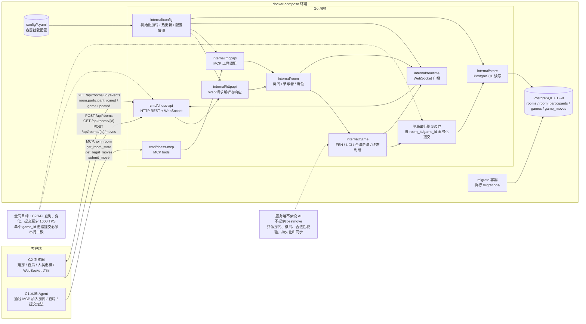

# Go Chess API 实现方案

## 目标与范围

基于 `2026-05-02_github-chess-project.md` 的需求，先实现一个以 Go 为后端核心的国际象棋 C/S 架构原型。

目标：

- 后端统一管理棋局状态、走棋校验、FEN 生成和局面同步。
- C1 是本地 Agent 客户端，通过 MCP 加入房间、读取局面、提交走法。
- C2 是浏览器客户端，人类用户通过 Web 创建房间、查看棋局、提交走法，并通过 WebSocket 接收房间和棋局变化。
- 局面数字化以 FEN 为主，走法输入输出以 UCI 为主，例如 `e2e4`、`e7e8q`。
- 第一阶段使用 PostgreSQL 持久化棋局和走法，不做账号、权限和线上部署。
- 开发环境、构建、运行、测试全部由 `docker-compose` 管理，不能在宿主机直接执行 Go 构建、测试或运行命令。
- 服务端不架设 AI，不提供建议走法。走法思考由外部 Agent 自行完成，服务端只负责房间、棋局数据、合法性校验和状态同步。

本轮不直接 fork 现成 Python 项目。原文档里的 `python-chess + FastAPI` 方案改为 Go 后端方案，前端仍可复用浏览器棋盘组件。

## 复用边界

当前目录只有需求 Markdown，没有现有代码可复用。

可复用的外部能力：

- Go 国际象棋规则库：优先评估 `github.com/notnil/chess`，用于 FEN 解析、合法走法、PGN/UCI 处理和棋局终态判断。
- 浏览器棋盘组件：可选 `chessboard.js` 或 React 生态棋盘组件。前端只负责展示和输入，不承担最终规则判断。
- MCP 适配层：本地 Agent 通过 MCP 工具调用服务端能力，MCP 层只做协议适配，不做棋力决策。

后端规则库是服务端可信来源。浏览器端即使用 `chess.js` 做交互辅助，也不能作为最终裁决。

## 架构边界

服务端模块建议：

- `cmd/chess-api`：HTTP 服务入口、配置读取、优雅退出。
- `cmd/chess-mcp`：MCP 服务入口，供本地 Agent 连接并操作房间。
- `internal/room`：房间聚合根，封装创建房间、加入房间、参与者和席位管理。
- `internal/game`：棋局聚合根，封装创建棋局、读取 FEN、提交 UCI 走法、获取合法走法、判断终态。
- `internal/httpapi`：REST API handler、请求校验、错误响应。
- `internal/mcpapi`：MCP tool handler，将 Agent 调用映射到房间和棋局服务。
- `internal/realtime`：WebSocket 连接管理，向浏览器广播棋局更新事件。
- `internal/store`：PostgreSQL 仓库，负责棋局和走法的持久化读写。
- `internal/config`：配置初始化加载、校验、运行时热更新和配置快照分发。

客户端边界：

- C1 Agent：只依赖 MCP，不直接依赖浏览器接口；可以加入房间、查询 FEN、查询合法走法、提交 UCI 走法。
- C2 浏览器：通过 HTTP 创建房间、读取房间和棋局、提交人类走法，通过 WebSocket 订阅房间棋局变更。

## 程序架构图



## 配置管理方案

Go 后端必须支持启动初始化加载配置，并支持运行中热更新配置。

配置文件要求：

- 配置文件建议放在 `config/app.yaml`，由 `docker-compose` 以只读 volume 挂载到容器内。
- `cmd/chess-api` 和 `cmd/chess-mcp` 启动时必须先加载配置，完成结构化解析和必填项校验后再启动服务。
- 配置解析失败、必填项缺失、类型不正确时，服务必须启动失败并输出明确错误。
- 环境变量只用于覆盖少量部署相关字段，例如数据库密码、监听端口、日志级别；最终运行配置以合并后的配置快照为准。

配置模块要求：

- `internal/config` 提供 `Load`、`Validate`、`Watch` 和 `Snapshot` 能力。
- 服务内部读取配置时不能到处直接读文件，应通过只读配置快照或订阅更新事件获取。
- 热更新时先解析新文件，再做完整校验；校验通过后原子替换配置快照。
- 热更新失败不能污染当前有效配置，服务继续使用上一份有效配置。
- 每次热更新成功或失败都必须记录日志，包含配置版本、更新时间和失败原因。

可热更新配置：

- 日志级别。
- CORS 允许来源。
- WebSocket 心跳间隔、写超时、每连接发送队列长度。
- 房间配置，例如 `room_code` 长度、房间空闲关闭时间。
- API 限流阈值，例如全局 C2/API 查询 TPS、单 IP 请求速率。

必须重启才能生效的配置：

- PostgreSQL 连接地址、用户名、密码、数据库名。
- HTTP/MCP 服务监听地址和端口。
- 数据库连接池基础容量。
- 迁移目录和迁移开关。

热更新触发方式：

- 第一阶段使用文件监听方式，监听容器内 `config/app.yaml`。
- 文件监听必须做短暂 debounce，避免编辑器连续写入导致重复加载。
- 后续如需运维入口，可以增加受控的 `POST /admin/reload-config`，第一阶段不做。

验收口径：

- 启动时能从挂载配置文件完成初始化加载。
- 修改可热更新字段后，服务无需重启即可使用新配置。
- 修改非法配置后，服务保留上一份有效配置，并返回或记录明确错误。
- 修改必须重启字段后，服务可以检测到变化并记录“需重启生效”，但不在运行中替换底层资源。

## 数据落表方案

第一阶段使用 PostgreSQL，数据库初始化、迁移、应用启动都必须通过 `docker-compose` 执行。

数据库要求：

- 数据库使用 PostgreSQL。
- 数据库字符集要求为 UTF-8。
- `docker-compose.yml` 中 PostgreSQL 服务必须显式设置初始化参数，确保 `POSTGRES_INITDB_ARGS=--encoding=UTF8 --locale=C`，或采用等价方式保证数据库编码为 UTF-8。
- 应用启动时必须校验数据库连接；如需校验编码，应通过 `SHOW SERVER_ENCODING` 确认返回 `UTF8`。
- 迁移脚本放在 `migrations/` 目录，由容器内迁移工具执行，不能在宿主机直接运行迁移命令。

核心数据模型：

- `RoomID`：服务端生成，建议使用 UUID。
- `RoomCode`：短码，给浏览器用户复制给本地 Agent 加入房间。
- `RoomStatus`：`waiting`、`active`、`finished`、`closed`。
- `Participant`：房间参与者，类型为 `human`、`agent`、`system`。
- `GameID`：服务端生成，建议使用 UUID。
- `FEN`：当前局面字符串。
- `Turn`：当前行动方，可从 FEN 推导，响应中冗余返回便于客户端展示。
- `Moves`：已执行 UCI 走法列表。
- `Status`：`active`、`checkmate`、`stalemate`、`draw`、`resigned`。
- `CreatedAt`、`UpdatedAt`：服务端时间，用于调试和展示。

建表方案：

```sql
CREATE TABLE rooms (
  id UUID PRIMARY KEY,
  code TEXT NOT NULL UNIQUE,
  status TEXT NOT NULL,
  created_by TEXT NOT NULL DEFAULT 'web',
  created_at TIMESTAMPTZ NOT NULL DEFAULT now(),
  updated_at TIMESTAMPTZ NOT NULL DEFAULT now()
);

CREATE TABLE room_participants (
  id BIGSERIAL PRIMARY KEY,
  room_id UUID NOT NULL REFERENCES rooms(id) ON DELETE CASCADE,
  participant_type TEXT NOT NULL,
  display_name TEXT NOT NULL,
  side TEXT NOT NULL DEFAULT 'spectator',
  joined_at TIMESTAMPTZ NOT NULL DEFAULT now(),
  UNIQUE (room_id, participant_type, display_name)
);

CREATE TABLE games (
  id UUID PRIMARY KEY,
  room_id UUID NOT NULL REFERENCES rooms(id) ON DELETE CASCADE,
  fen TEXT NOT NULL,
  status TEXT NOT NULL,
  created_at TIMESTAMPTZ NOT NULL DEFAULT now(),
  updated_at TIMESTAMPTZ NOT NULL DEFAULT now()
);

CREATE TABLE game_moves (
  id BIGSERIAL PRIMARY KEY,
  game_id UUID NOT NULL REFERENCES games(id) ON DELETE CASCADE,
  ply INTEGER NOT NULL,
  uci TEXT NOT NULL,
  san TEXT NOT NULL DEFAULT '',
  actor TEXT NOT NULL DEFAULT 'system',
  fen_after TEXT NOT NULL,
  created_at TIMESTAMPTZ NOT NULL DEFAULT now(),
  UNIQUE (game_id, ply)
);

CREATE INDEX idx_game_moves_game_id_ply ON game_moves(game_id, ply);
CREATE INDEX idx_games_room_id ON games(room_id);
CREATE INDEX idx_room_participants_room_id ON room_participants(room_id);
```

字段规则：

- `rooms.code` 是房间加入码，由服务端生成，供 Web 用户复制给本地 MCP Agent。
- `room_participants.side` 可选 `white`、`black`、`spectator`，第一阶段只做席位记录，不做强鉴权。
- `games.room_id` 表示棋局隶属房间。第一阶段一个房间只创建一盘棋。
- `games.fen` 保存当前局面，作为读取棋局的主来源。
- `game_moves.fen_after` 保存每步之后的局面快照，用于回放和排查。
- `game_moves.actor` 只做留痕，可选值 `human`、`agent`、`system`，不参与业务判断。
- `games.status` 使用应用层枚举约束，第一阶段不强制数据库 enum，降低迁移复杂度。
- 当前行动方 `turn` 从 FEN 推导，不单独落表。

一致性要求：

- Web 创建房间时，在一个事务内写入 `rooms` 和初始 `games`。
- Agent 通过 MCP 加入房间时写入 `room_participants`。
- 提交走法时必须在一个数据库事务内更新 `games` 并插入 `game_moves`。
- `ply` 由当前棋局已有走法数加一得到，必须和 `UNIQUE (game_id, ply)` 配合避免重复写入。

## 请求解析与校验

统一约定：

- `Content-Type: application/json`
- 请求和响应使用 JSON。
- 走法使用 UCI 格式。
- 局面使用标准 FEN。
- `room_id`、`game_id` 只由服务端创建，客户端不能自行指定。
- Web 创建房间后，服务端返回 `room_code`。本地 Agent 通过 MCP 使用 `room_code` 加入房间。

接口草案：

### `POST /api/rooms`

Web 创建房间，并自动创建初始棋局。

请求：

```json
{
  "fen": "optional fen",
  "display_name": "human"
}
```

规则：

- 未传 `fen` 时创建标准初始局面。
- 传入 `fen` 时必须能被规则库解析。
- 非法 FEN 返回 `400 invalid_fen`。

响应：

```json
{
  "room_id": "uuid",
  "room_code": "ABCD12",
  "game_id": "uuid",
  "fen": "current fen",
  "turn": "white",
  "status": "active",
  "legal_moves": ["e2e4"]
}
```

### `GET /api/rooms/{room_id}`

读取房间和当前棋局状态。

响应包含：

- `room_id`
- `room_code`
- `room_status`
- `participants`
- `game_id`
- `fen`
- `turn`
- `status`
- `legal_moves`
- `moves`
- `updated_at`

### `POST /api/rooms/{room_id}/moves`

Web 提交人类走法。

请求：

```json
{
  "uci": "e2e4"
}
```

规则：

- `uci` 必填，必须是当前局面的合法走法。
- Web 提交的走法固定按 `human` 写入留痕，浏览器不能指定可信 `actor`。
- 棋局非 `active` 时拒绝走棋。
- 成功后持久化更新 PostgreSQL 棋局和走法记录，并向 WebSocket 订阅者广播 `game.updated`。

### `GET /api/rooms/{room_id}/legal-moves`

返回当前局面所有合法 UCI 走法。

用途：

- C2 浏览器高亮可走位置。

### MCP 工具：`join_room`

本地 Agent 加入 Web 用户创建的房间。

请求：

```json
{
  "room_code": "ABCD12",
  "display_name": "local-agent",
  "side": "black"
}
```

规则：

- `room_code` 必须存在，且房间状态不能是 `closed`。
- `side` 可选 `white`、`black`、`spectator`。第一阶段只记录席位，不做严格抢占策略。
- 成功加入后向 WebSocket 订阅者广播 `room.participant_joined`。

响应：

```json
{
  "room_id": "uuid",
  "game_id": "uuid",
  "fen": "current fen",
  "turn": "white",
  "status": "active",
  "legal_moves": ["e2e4"]
}
```

### MCP 工具：`get_room_state`

本地 Agent 读取房间和棋局状态。

请求：

```json
{
  "room_id": "uuid"
}
```

响应包含：

- `room_id`
- `game_id`
- `fen`
- `turn`
- `status`
- `legal_moves`
- `moves`
- `participants`

### MCP 工具：`submit_move`

本地 Agent 提交自行思考出的走法。

请求：

```json
{
  "room_id": "uuid",
  "uci": "e7e5",
  "display_name": "local-agent"
}
```

规则：

- 服务端不生成或建议走法，只校验 Agent 提交的走法是否合法。
- `display_name` 用于写入 `game_moves.actor` 的留痕来源，业务判断仍以当前棋局合法性为准。
- 成功后持久化更新 PostgreSQL 棋局和走法记录，并向 WebSocket 订阅者广播 `game.updated`。

### MCP 工具：`get_legal_moves`

本地 Agent 获取当前局面的合法 UCI 走法。

请求：

```json
{
  "room_id": "uuid"
}
```

响应：

```json
{
  "room_id": "uuid",
  "game_id": "uuid",
  "legal_moves": ["e2e4", "d2d4"]
}
```

### `GET /api/rooms/{room_id}/events`

WebSocket 订阅房间和棋局更新。

服务端事件：

```json
{
  "type": "game.updated",
  "room_id": "uuid",
  "game_id": "uuid",
  "fen": "current fen",
  "last_move": "e2e4",
  "turn": "black",
  "status": "active"
}
```

## 业务处理

Web 创建房间：

1. 解析可选 FEN。
2. 初始化规则库棋盘对象。
3. 生成 `room_id`、`room_code` 和 `game_id`。
4. 在一个事务内写入 `rooms`、`room_participants` 和 `games`。
5. 返回房间、棋局、当前局面和合法走法。

Agent 加入房间：

1. MCP 层接收 `room_code`、`display_name` 和可选 `side`。
2. 根据 `room_code` 查询房间。
3. 如果房间不存在，返回 `404 room_not_found`。
4. 如果房间已关闭，返回 `409 room_closed`。
5. 写入 `room_participants`。
6. 广播 `room.participant_joined`。
7. 返回当前棋局状态。

提交走法：

1. 根据 `room_id` 读取房间和当前棋局。
2. 如果房间不存在，返回 `404 room_not_found`；如果棋局不存在，返回 `404 game_not_found`。
3. 如果棋局已结束，返回 `409 game_finished`。
4. 用规则库在当前局面解析并验证 UCI。
5. 合法则执行走法，在一个事务内更新 `games` 并插入 `game_moves`。
6. 广播 `game.updated`。
7. 返回更新后的棋局状态。

## 响应组装

统一响应字段命名使用 `snake_case`，时间使用 RFC3339。

棋局状态响应建议统一结构：

```json
{
  "room_id": "uuid",
  "room_code": "ABCD12",
  "game_id": "uuid",
  "fen": "current fen",
  "turn": "white",
  "status": "active",
  "legal_moves": [],
  "moves": [],
  "updated_at": "2026-05-02T20:00:00+08:00"
}
```

错误响应：

```json
{
  "error": {
    "code": "invalid_move",
    "message": "move is not legal in current position"
  }
}
```

## 错误口径

- `400 invalid_json`：请求体不是合法 JSON。
- `400 invalid_fen`：FEN 无法解析或不是合法局面。
- `400 invalid_move_format`：走法不是 UCI 格式。
- `404 room_not_found`：房间不存在。
- `404 game_not_found`：棋局不存在。
- `409 invalid_move`：走法格式正确，但在当前局面不合法。
- `409 room_closed`：房间已关闭，不能加入或走棋。
- `409 game_finished`：棋局已经结束，不能继续走棋。
- `500 internal_error`：未预期错误。

错误信息不返回 Go 内部错误栈。

## 强制执行顺序

1. 初始化 Go module、目录结构和 `docker-compose.yml`，定义 `api`、`postgres`、`migrate` 服务。
2. 所有 Go 构建、运行、测试命令都写入容器命令或 Make target，Make target 内部只能调用 `docker-compose`。
3. 新增 `config/app.yaml` 和 `internal/config`，先实现启动初始化加载、校验、配置快照和热更新。
4. 选择并验证 Go 棋规库，spike 必须在容器内执行：初始局面、FEN、合法走法、UCI 执行。
5. 新增 PostgreSQL 迁移脚本，创建 `rooms`、`room_participants`、`games` 和 `game_moves`，确保数据库 UTF-8。
6. 通过 `docker-compose` 执行迁移，并校验 `SHOW SERVER_ENCODING` 返回 `UTF8`。
7. 实现 `internal/room` 和 `internal/game`，覆盖创建房间、加入房间、查询、合法走法、提交走法、终态判断。
8. 实现 PostgreSQL `store`，走法提交必须使用事务。
9. 实现 REST API，不做 WebSocket。
10. 在容器内为 REST API、store 和 config 增加最小集成测试。
11. 实现 MCP 工具：`join_room`、`get_room_state`、`get_legal_moves`、`submit_move`。
12. 实现 WebSocket 广播。
13. 增加最小浏览器页面，用于创建房间、展示房间码、展示 FEN 棋盘和提交走法。

## Review 结论

当前需求适合从 Go API 原型开始，而不是先改造一个 Python/FastAPI 项目。

原因：

- 用户明确希望 API 使用 Go 实现。
- 当前目录没有既有代码，直接新建 Go 服务影响最小。
- 国际象棋规则复杂，服务端必须复用成熟规则库，不能手写完整规则。
- C1 和 C2 的分工清晰：本地 Agent 走 MCP，浏览器走 HTTP/WebSocket，服务端作为状态裁决者。
- 第一阶段直接使用 PostgreSQL，可以把房间、棋局状态、走法回放和 Agent 调试记录稳定保存下来。
- 后端不架设 AI，可以避免把“棋力决策”和“棋局裁决”耦合在同一个服务里。
- 全部开发命令收束到 `docker-compose`，可以避免宿主机 Go、PostgreSQL、迁移工具版本不一致。

## 验收口径

第一阶段完成后应满足：

- 通过 `docker-compose` 可以启动 PostgreSQL、执行迁移、启动 Go API。
- PostgreSQL 数据库编码为 UTF-8，`SHOW SERVER_ENCODING` 返回 `UTF8`。
- 容器内测试通过，例如 `docker-compose run --rm api go test ./...`。
- Go 后端启动时可以初始化加载配置；修改可热更新配置后无需重启即可生效；非法热更新不会覆盖上一份有效配置。
- Web 可以创建房间并返回 `room_code`、`game_id` 和标准初始 FEN。
- 本地 Agent 可以通过 MCP 使用 `room_code` 加入房间。
- Web 和 MCP 都可以查询棋局状态和合法走法。
- 可以提交合法 UCI 走法并得到新 FEN，同时 `games` 和 `game_moves` 正确落表。
- 非法 FEN、非法走法、已结束棋局继续走棋都有明确错误码。
- Agent 可以只用 MCP 完成“加入房间 -> 读取局面 -> 获取合法走法 -> 提交走法”。
- 浏览器可以看到房间参与者和棋局更新，至少能通过 WebSocket 接收 `room.participant_joined` 和 `game.updated`。

## 待确认项

- 第一阶段前端使用纯 HTML + JavaScript，还是 React。
- 第一阶段同一房间是否只允许一个 Agent 参与，还是允许多个 Agent 作为观察者加入。
- `room_code` 使用 6 位短码是否足够，还是需要更长随机码。

## 本轮不做

- 用户账号和鉴权。
- 联机大厅、匹配系统、观战列表。
- PGN 导入导出。
- 计时器和超时判负。
- 服务端 AI、Stockfish、bestmove 或任何后端建议走法能力。
- 复杂前端交互和完整棋子拖拽体验。
